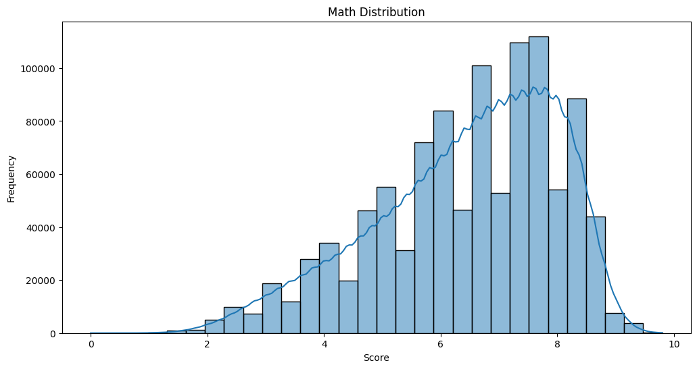
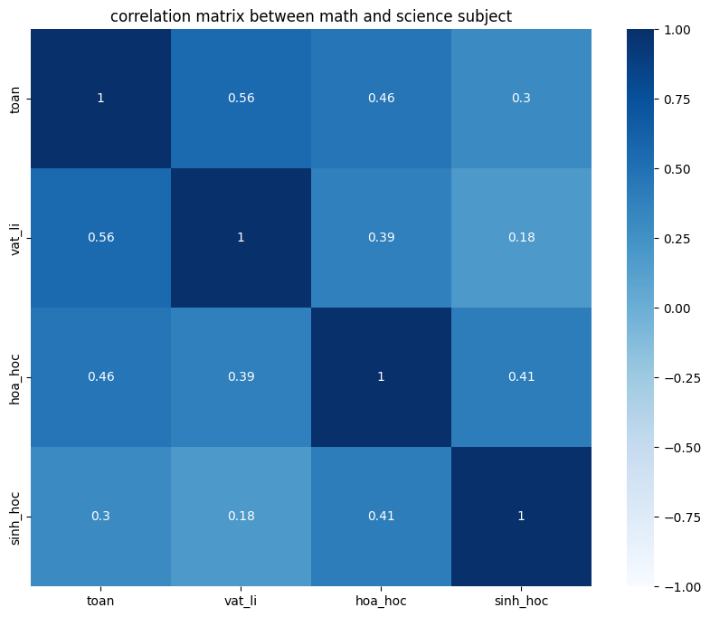
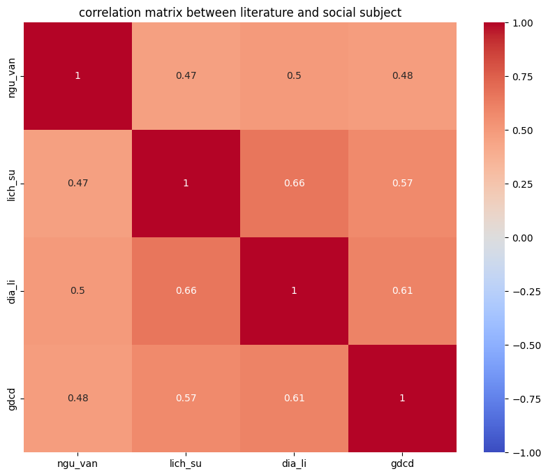
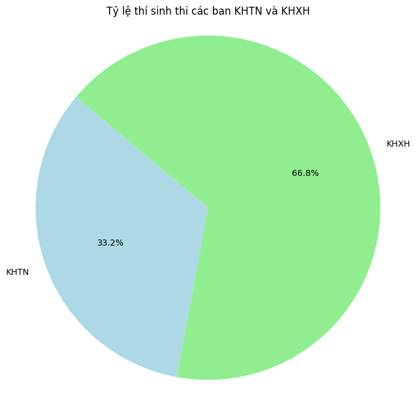
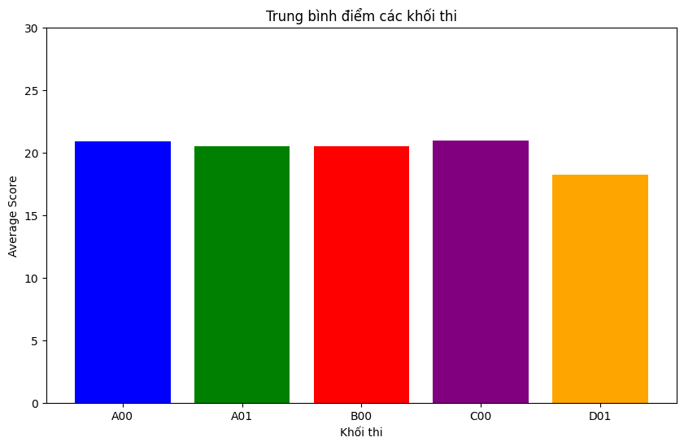
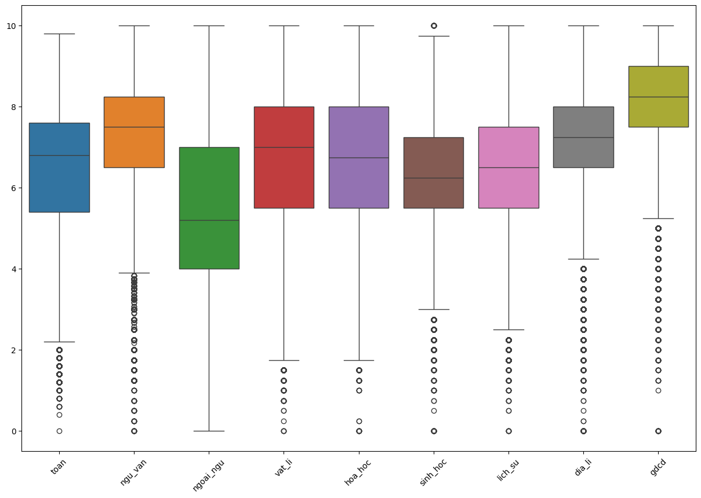
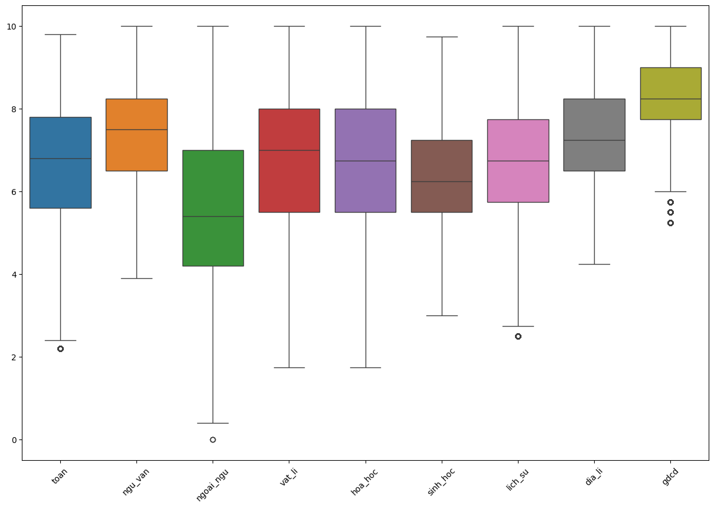
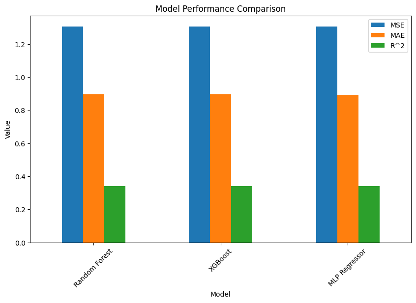

# Phân tích dữ liệu điểm thi THPT 2024 và dự đoán điểm Toán 2025 bằng mô hình hồi quy

*Nguồn ảnh: [baodautu.vn](https://baodautu.vn/ky-thi-tot-nghiep-thpt-2024-la-mua-thi-cuoi-cung-thuc-hien-theo-chuong-trinh-cu-d218276.html)*

## Lưu ý 1:

Đây là project do mình làm, cũng là ví dụ cho một bài hoàn chỉnh về Data Analysis và áp dụng Machine Learning.

Dưới đây chỉ là tóm tắt sơ bộ về project, chi tiết hơn vui lòng xem trên tải bản zip trên release, bên trong có file .ipynb phân tích dữ liệu đầy đủ cũng như sử dụng mô hình hồi quy để dự đoán điểm.

Về data gốc (raw data), các bạn có thể lấy từ [J2TEAM](https://www.facebook.com/groups/j2team.community/permalink/2423907054608067/).

## BÀI LÀM
### 1. Load dữ liệu
Dữ liệu sẽ có dạng như sau, ở đây mình chỉ load vài thông tin:
| sbd     | toán | ngữ văn | ngoại ngữ | vật lí | hóa học | sinh học | lịch sử | địa lí | gdcd | mã ngoại ngữ |
|---------|------|---------|-----------|--------|---------|----------|---------|--------|------|--------------|
| 1000001 | 8.4  | 6.75    | 8.0       | 6.0    | 5.25    | 5.0      | NaN     | NaN    | NaN  | N1           |
| 1000002 | 8.6  | 8.50    | 7.2       | NaN    | NaN     | NaN      | 7.25    | 6.00   | 8.00 | N1           |
| 1000003 | 8.2  | 8.75    | 8.2       | NaN    | NaN     | NaN      | 7.25    | 7.25   | 8.75 | N1           |
| 1000004 | 4.8  | 8.50    | 7.4       | NaN    | NaN     | NaN      | 7.00    | 6.00   | 7.50 | N1           |
| 1000005 | 8.6  | 9.00    | 7.8       | NaN    | NaN     | NaN      | 9.00    | 8.75   | 8.50 | N1           |

Sau đó mình sẽ tiền xử lý data trên xem có dòng nào bị thiếu hoặc trùng lặp không.

### 2. Explore Data Analysis
Ta sẽ có những thống kê cơ bản từ data trên.

**Biểu đồ phân phối môn toán:**

**Biểu đồ phân phối môn văn:**

**Ma trận tương quan giữa môn toán và các môn KHTN (Lý, Hóa, Sinh)**

Nhận xét: Những thí sinh điểm cao trong môn toán dường như điểm vật lý cũng tốt (0.56), và điểm hóa học cũng ổn (0.46).

**Ma trận tương quan giữa môn văn và các môn KHXH (Sử, Địa, GDCD)**

Nhận xét: Môn văn ít tương quan với cả ba môn. Nhưng môn lịch sử tương quan mạnh với môn địa lý (0.66).

**Biểu đồ tròn số lượng thí sinh thi tổ hợp KHTN và ban KHXH**

Nhận xét: Số thí sinh thi tổ hợp KHXH nhiều gấp đôi số thi sinh thi tổ hợp KHTN

**Tính điểm trung bình cho các khối môn học**

Nhận xét: Điểm giữa các tổ hợp có vẻ cân bằng, điểm trung bình khoảng 20. Khối C00 có phần cao hơn so với các khối khác.

### 3. Kiểm tra và loại bỏ các outliers
Outliers là điểm ngoại lai có giá trị khác biệt so với mặt bằng chung của dữ liệu. Nếu có nhiều outliers sẽ ảnh hưởng đến quá trình phát triển mô hình máy học, dẫn đến sai sót, vì vậy nên ta cần phải giảm thiểu các outliers này.

**Vẽ boxplot để xem thử điểm các môn học có outliers không:**

Nhận xét: Vậy là ngoại trừ môn ngoại ngữ, các môn còn lại đều có nhiều outliers, ta sẽ xử lý các outliers đó.

**Dữ liệu sau khi được xử lý các outliers:**

### 4. Áp dụng các mô hình máy học (Ví dụ cho môn toán)
Ở đây mình sẽ sử dụng mô hình hồi quy (regression) để dự đoán điểm toán THPT năm 2025. Mình sẽ sử dụng 3 model hồi quy đó là:
- **XGBoost**: Thuật toán sử dụng decision tree nhưng cải thiện hiệu suất, tăng cường độ dốc (gradient boosting) hiệu quả và linh hoạt.
- **Random Forest**: Thuật toán dựa trên phương pháp ensemble (tập hợp), sử dụng nhiều decision tree để phân tích dữ liệu, giảm thiểu hiện tượng overfitting
- **MLPRegressor**: Thuật toán sử dụng mạng lưới neural networks để xử lý và dự đoán dữ liệu.

### 5. So sánh các model, cho biết model nào tốt nhất và dự đoán kết quả.
Sau khi chạy 3 model trên, ta có thống kê về MSE, MAE và R^2 score như sau:

| Model           | MSE       | MAE       | R^2      |
|-----------------|-----------|-----------|----------|
| Random Forest   | 1.306347  | 0.895647  | 0.340203 |
| XGBoost         | 1.305207  | 0.895389  | 0.340779 |
| MLP Regressor   | 1.304868  | 0.894471  | 0.340950 |

Từ đó ta suy ra MLP Regressor là model hồi quy tốt nhất cho data này.

Mình sẽ lấy 80% tập train và 20% tập test để training model MLP Regressor, kết quả cho ra trung bình điểm toán THPT năm 2025 là 6.646, hơn thế nữa mô hình cũng dự đoán 91% thí sinh sẽ trong khoảng điểm từ 5.0-7.8 và chỉ 1% thí sinh mới có kết quả điểm trên 8.

Biểu đồ so sánh các model:

Nhận xét: Cả 3 model này có hiệu suất gần như tương đương nhau, nhưng MLPRegressor có hiệu suất tốt hơn một chút, nhưng thời gian chạy lại lâu nhất trong cả 3 model.

## Lưu ý 2:
Đây chỉ là minh họa cho một bài Data Analysis hoàn chỉnh, vui lòng không lấy điểm dự đoán này làm chuẩn vì các thuật toán chỉ dự đoán một cách tương đối và năm 2025 sẽ không thi tốt nghiệp THPT theo cấu trúc từ năm 2017 như trước nữa.
