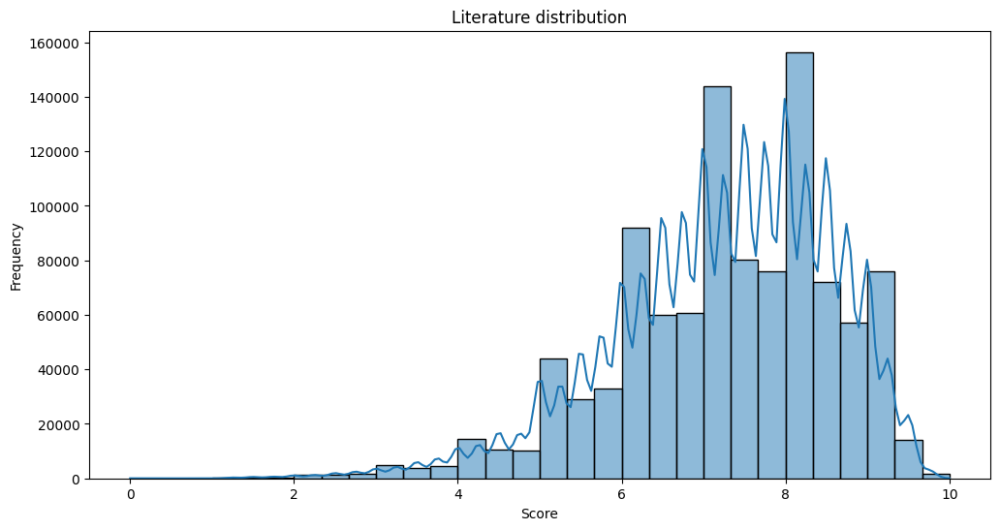

# Analyze data điểm thi của các thí sinh tốt nghiệp THPT năm 2024 và dự đoán điểm toán năm 2025 sử dụng các mô hình hồi quy

Đây là project do mình làm, cũng là ví dụ cho một bài Data Analysis hoàn chỉnh.

Dưới đây chỉ là tóm tắt sơ bộ về project, chi tiết hơn vui lòng xem trên file AnalyzeData_Thi_THPT_2024.ipynb.

## 1. Load dữ liệu
Dữ liệu sẽ có dạng như sau, ở đây mình chỉ load vài thông tin:
| sbd     | toán | ngữ văn | ngoại ngữ | vật lí | hóa học | sinh học | lịch sử | địa lí | gdcd | mã ngoại ngữ |
|---------|------|---------|-----------|--------|---------|----------|---------|--------|------|--------------|
| 1000001 | 8.4  | 6.75    | 8.0       | 6.0    | 5.25    | 5.0      | NaN     | NaN    | NaN  | N1           |
| 1000002 | 8.6  | 8.50    | 7.2       | NaN    | NaN     | NaN      | 7.25    | 6.00   | 8.00 | N1           |
| 1000003 | 8.2  | 8.75    | 8.2       | NaN    | NaN     | NaN      | 7.25    | 7.25   | 8.75 | N1           |
| 1000004 | 4.8  | 8.50    | 7.4       | NaN    | NaN     | NaN      | 7.00    | 6.00   | 7.50 | N1           |
| 1000005 | 8.6  | 9.00    | 7.8       | NaN    | NaN     | NaN      | 9.00    | 8.75   | 8.50 | N1           |

Sau đó mình sẽ tiền xử lý data trên xem có dòng nào bị thiếu hoặc trùng lặp không.

## 2. EDA
**Biểu đồ phân phối môn toán:**

**Biểu đồ phân phối môn văn:**

**Ma trận tương quan giữa môn toán và các môn KHTN (Lý, Hóa, Sinh)**

Nhận xét: Những thí sinh điểm cao trong môn toán dường như điểm vật lý cũng tốt (0.56), và điểm hóa học cũng ổn (0.46).

**Ma trận tương quan giữa môn văn và các môn KHXH (Sử, Địa, GDCD)**

Nhận xét: Môn văn ít tương quan với cả ba môn. Nhưng môn lịch sử tương quan mạnh với môn địa lý (0.66).

**Biểu đồ tròn số lượng thí sinh thi tổ hợp KHTN và ban KHXH**

Nhận xét: Số thí sinh thi tổ hợp KHXH nhiều gấp đôi số thi sinh thi tổ hợp KHTN

**Tính điểm trung bình cho các khối môn học**

Nhận xét: Điểm giữa các tổ hợp có vẻ cân bằng, điểm trung bình khoảng 20. Khối C00 có phần cao hơn so với các khối khác.

